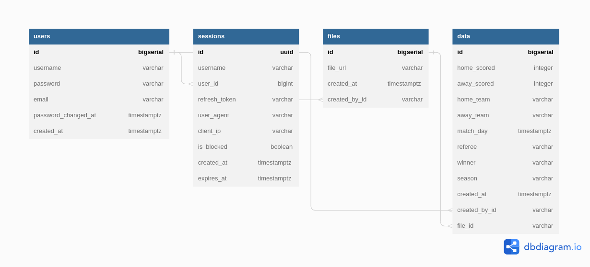

# Serverless ETL

- Adaptation of ts-file upload done using Golang.

## Overview

- Project description similar to the [ts-fileupload](https://github.com/ShadrackAdwera/ts-fileupload)

## Schema

## Technologies

- gRPC
- gRPC gateway
- protoc
- Gin
- Testify
- GoMock
- Sqlc
- Postgres
- Redis (Message Queue)

## Useful commands

- `make create_db` spin up the database go_elt from a postgres15 image, run the image using the flag `--name postgres15`
- `make migrate_init` initialise schema migration
- `make migrate_up` run up migration
- `make migrate_down` run down migration
- `make sqlc` generate code for CRUD operations to Postgres
- `make tests` run tests
